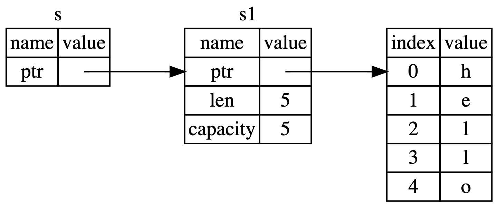
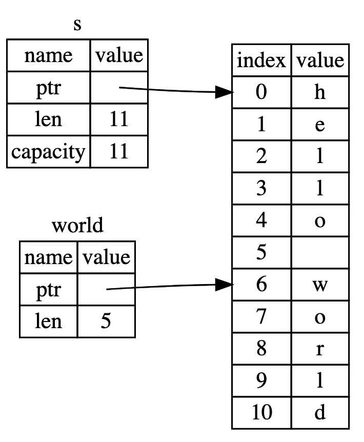

# Rust

## Formatted Print

- [`format!`](https://doc.rust-lang.org/std/macro.format.html): write formatted text to `String` (`fmt.Sprintf`)
- [`print!`](https://doc.rust-lang.org/std/macro.print.html): same as `format!` but text is printed to `io::stdout` (`fmt.Printf`)
- [`println!`](https://doc.rust-lang.org/std/macro.println.html): same as `print!` but a newline appended (`fmt.Printf("...\n", ...`))
- [`eprint!`](https://doc.rust-lang.org/std/macro.eprint.html): same as `format!` but text is printed to `io::stderr`
- [`println!`](https://doc.rust-lang.org/std/macro.eprintln.html): same as `eprint!` but a newline appended.

### Important Traits in `std::fmt`

- [`std::ftm::Debug`](https://doc.rust-lang.org/std/fmt/trait.Debug.html)
  - uses the `{:?}` marker.
  - format text for debugging purposes.
  - `#[derive(Debug)]` to implement `std::ftm::Debug` automatically.
  - `{:#?}`: ==pretty printing==.
- [`std::ftm::Display`](https://doc.rust-lang.org/std/fmt/trait.Display.html)
  - uses the `{}` marker.
  - format text in a more elegant, user friendly fashion.
  - automatically implements `ToString` trait which allows us to convert type to `String`

### Formatting

- nothing => `std::ftm::Display`
- `x?` => `Debug` with lower-case hexadecimal integers.
- `X?` => `Debug` with upper-case hexadecimal integers.
- `o` => [`std::ftm::Ocatal`](https://doc.rust-lang.org/std/fmt/trait.Octal.html)
- `x` => [`std::ftm::LowerHex`](https://doc.rust-lang.org/std/fmt/trait.LowerHex.html)
- `X` => [`std::ftm::UpperHex`](https://doc.rust-lang.org/std/fmt/trait.UpperHex.html)
- `p` => [`std::ftm::Pointer`](https://doc.rust-lang.org/std/fmt/trait.Pointer.html)
- `b` => [`std::ftm::Binary`](https://doc.rust-lang.org/std/fmt/trait.Binary.html)
- `e` => [`std::ftm::LowerExp`](https://doc.rust-lang.org/std/fmt/trait.LowerExp.html)
- `E` => [`std::ftm::UpperExp`](https://doc.rust-lang.org/std/fmt/trait.UpperHex.html)

## `Result` and `?`

> Chaining results using match can get pretty untidy; luckily, the `?` operator can be used to make things pretty again. `?` is used at the end of an expression returning a Result, and is equivalent to a match expression, where the `Err(err)` branch expands to an early `Err(From::from(err))`, and the `Ok(ok)` branch expands to an `ok` expression.

- if OK, getting value.
- if fails, early `return` Error.

## Shadowing

shadowing is creating a new variable and reusing the same name.

## Data Types

- default type
  - integer: i32
  - float: f64

- char: 4 bytes

- array: (in stack)
  - `let a: [i32; 5] = [1, 2, 3, 4, 5]`
  - `let a = [1, 2, 3, 4, 5]`
  - `let a = [3; 5]` ≡ `let a = [3, 3, 3, 3, 3]` (repeated)

### Casting

- `as` keyword
- ==No implicit== conversion

## Conversion

- [`From`](https://doc.rust-lang.org/std/convert/trait.From.html)
  - **`From<T> for U` implies `Into<U> for T`**
- [`Into`](https://doc.rust-lang.org/std/convert/trait.Into.html)

```rust
#[derive(Debug)]
struct Number {
    value: i32,
}

impl From<i32> for Number {
    fn from(item: i32) -> Self {
        Number { value: item }
    }
}

let num = Number::from(30);

let int = 5;
let num: Number = int.into();
```

- [TryFrom](https://doc.rust-lang.org/std/convert/trait.TryFrom.html)
  - **`TryFrom<T> for U impiles TryInfo<U> for T`**
- [TryInto](https://doc.rust-lang.org/std/convert/trait.TryInto.html)

```rust
use std::convert::TryFrom;
use std::convert::TryInto;

#[derive(Debug, PartialEq)]
struct EvenNumber(i32);

impl TryFrom<i32> for EvenNumber {
    type Error = ();

    fn try_from(value: i32) -> Result<Self, Self::Error> {
        if value % 2 == 0 {
            Ok(EvenNumber(value))
        } else {
            Err(())
        }
    }
}

fn main() {
    // TryFrom

    assert_eq!(EvenNumber::try_from(8), Ok(EvenNumber(8)));
    assert_eq!(EvenNumber::try_from(5), Err(()));

    // TryInto

    let result: Result<EvenNumber, ()> = 8i32.try_into();
    assert_eq!(result, Ok(EvenNumber(8)));
    let result: Result<EvenNumber, ()> = 5i32.try_into();
    assert_eq!(result, Err(()));
}
```

### To and From Strings

- Convering to `String`:
  - [`std::string::ToString`](https://doc.rust-lang.org/std/string/trait.ToString.html)
  -`std::ftm::Display` implies `std::string::ToString`
- Parsing a String
  - [`std::str::FromStr`](https://doc.rust-lang.org/std/str/trait.FromStr.html)
  - used by [`parse`](https://doc.rust-lang.org/std/primitive.str.html#method.parse) ==implicitly==.

## Control

### If

if can return a value. like `? :`

```rust
let number = if condition {
    5
} else {
    6
};
```

### Loop

loop can return a value (`loop break`)

```rust
let result = loop {
    count += 1;

    if counter == 10 {
        break counter * 2;
    }
};
```

### Match

syntax:

```rust
match number {
    // Match a single value
    1 => println!("One!"),
    // Match several values
    2 | 3 | 5 | 7 | 11 => println!("This is a prime"),
    // Match an inclusive range
    13..=19 => println!("A teen"),
    // Handle the rest of cases
    _ => println!("Ain't special"),
}
```

#### Destructuring

- **tuples**:

    ```rust
    fn main() {
        let pair = (0, -2);
        // TODO ^ Try different values for `pair`

        println!("Tell me about {:?}", pair);
        // Match can be used to destructure a tuple
        match pair {
            // Destructure the second
            (0, y) => println!("First is `0` and `y` is `{:?}`", y),
            (x, 0) => println!("`x` is `{:?}` and last is `0`", x),
            _      => println!("It doesn't matter what they are"),
            // `_` means don't bind the value to a variable
        }
    }
    ```

- **enums**:

    ```rust
    // `allow` required to silence warnings because only
    // one variant is used.
    #[allow(dead_code)]
    enum Color {
        // These 3 are specified solely by their name.
        Red,
        Blue,
        Green,
        // These likewise tie `u32` tuples to different names: color models.
        RGB(u32, u32, u32),
        HSV(u32, u32, u32),
        HSL(u32, u32, u32),
        CMY(u32, u32, u32),
        CMYK(u32, u32, u32, u32),
    }

    fn main() {
        let color = Color::RGB(122, 17, 40);
        // TODO ^ Try different variants for `color`

        println!("What color is it?");
        // An `enum` can be destructured using a `match`.
        match color {
            Color::Red   => println!("The color is Red!"),
            Color::Blue  => println!("The color is Blue!"),
            Color::Green => println!("The color is Green!"),
            Color::RGB(r, g, b) =>
                println!("Red: {}, green: {}, and blue: {}!", r, g, b),
            Color::HSV(h, s, v) =>
                println!("Hue: {}, saturation: {}, value: {}!", h, s, v),
            Color::HSL(h, s, l) =>
                println!("Hue: {}, saturation: {}, lightness: {}!", h, s, l),
            Color::CMY(c, m, y) =>
                println!("Cyan: {}, magenta: {}, yellow: {}!", c, m, y),
            Color::CMYK(c, m, y, k) =>
                println!("Cyan: {}, magenta: {}, yellow: {}, key (black): {}!",
                    c, m, y, k),
            // Don't need another arm because all variants have been examined
        }
    }
    ```

- **structure**:

    ```rust
    fn main() {
        struct Foo {
            x: (u32, u32),
            y: u32,
        }

        // Try changing the values in the struct to see what happens
        let foo = Foo { x: (1, 2), y: 3 };

        match foo {
            Foo { x: (1, b), y } => println!("First of x is 1, b = {},  y = {} ", b, y),

            // you can destructure structs and rename the variables,
            // the order is not important
            Foo { y: 2, x: i } => println!("y is 2, i = {:?}", i),

            // and you can also ignore some variables:
            Foo { y, .. } => println!("y = {}, we don't care about x", y),
            // this will give an error: pattern does not mention field `x`
            //Foo { y } => println!("y = {}", y);
        }
    }
    ```

- **pointers/ref**:

    ```rust
    fn main() {
        println!("Hello, world!");

        let r = &4;
        println!("{:?}", r);

        match r {
            //&val => println!("& {:?}", val),
            //ref val => println!("ref {:?}", val),
            x => println!("any {:?}", x),
        }

        let mut v = 5;

        match v {
            ref r => println!("get ref {:?}", r),
        }

        match v {
            ref mut r => {
                *r += 10;
            },
        }

        println!("{:?}", v); // 15

        match v {
            mut mutv => {
                mutv += 10;
            },
        }

        println!("{:?}", v); // 15
    }
    ```

Keyword: `ref`

- assignment (`let ref _is_a_reference = 3;`): create a reference for the element.
- match: match and get a reference of the value.

    ```rust
    // Use `ref` keyword to create a reference.
    match value {
        ref r => println!("Got a reference to a value: {:?}", r),
    }

    // Use `ref mut` similarly.
    match mut_value {
        ref mut m => {
            // Got a reference. Gotta dereference it before we can
            // add anything to it.
            *m += 10;
            println!("We added 10. `mut_value`: {:?}", m);
        },
    }
    ```

#### Guards

```rust
fn main() {
    let pair = (2, -2);
    // TODO ^ Try different values for `pair`

    println!("Tell me about {:?}", pair);
    match pair {
        (x, y) if x == y => println!("These are twins"),
        // The ^ `if condition` part is a guard
        (x, y) if x + y == 0 => println!("Antimatter, kaboom!"),
        (x, _) if x % 2 == 1 => println!("The first one is odd"),
        _ => println!("No correlation..."),
    }
}
```

#### Binding

```rust
// A function `age` which returns a `u32`.
fn age() -> u32 {
    15
}

fn main() {
    println!("Tell me what type of person you are");

    match age() {
        0             => println!("I'm not born yet I guess"),
        // Could `match` 1 ..= 12 directly but then what age
        // would the child be? Instead, bind to `n` for the
        // sequence of 1 ..= 12. Now the age can be reported.
        n @ 1  ..= 12 => println!("I'm a child of age {:?}", n),
        n @ 13 ..= 19 => println!("I'm a teen of age {:?}", n),
        // Nothing bound. Return the result.
        n             => println!("I'm an old person of age {:?}", n),
    }
}
```

```rust
// A function `age` which returns a `u32`.
fn age() -> u32 {
    15
}

fn main() {
    println!("Tell me what type of person you are");

    match age() {
        0             => println!("I'm not born yet I guess"),
        // Could `match` 1 ..= 12 directly but then what age
        // would the child be? Instead, bind to `n` for the
        // sequence of 1 ..= 12. Now the age can be reported.
        n @ 1  ..= 12 => println!("I'm a child of age {:?}", n),
        n @ 13 ..= 19 => println!("I'm a teen of age {:?}", n),
        // Nothing bound. Return the result.
        n             => println!("I'm an old person of age {:?}", n),
    }
}
```

### if let

```rust
fn main() {
    // All have type `Option<i32>`
    let number = Some(7);
    let letter: Option<i32> = None;
    let emoticon: Option<i32> = None;

    // The `if let` construct reads: "if `let` destructures `number` into
    // `Some(i)`, evaluate the block (`{}`).
    if let Some(i) = number {
        println!("Matched {:?}!", i);
    }

    // If you need to specify a failure, use an else:
    if let Some(i) = letter {
        println!("Matched {:?}!", i);
    } else {
        // Destructure failed. Change to the failure case.
        println!("Didn't match a number. Let's go with a letter!");
    }

    // Provide an altered failing condition.
    let i_like_letters = false;

    if let Some(i) = emoticon {
        println!("Matched {:?}!", i);
    // Destructure failed. Evaluate an `else if` condition to see if the
    // alternate failure branch should be taken:
    } else if i_like_letters {
        println!("Didn't match a number. Let's go with a letter!");
    } else {
        // The condition evaluated false. This branch is the default:
        println!("I don't like letters. Let's go with an emoticon :)!");
    }
}
```

```rust
// Our example enum
enum Foo {
    Bar,
    Baz,
    Qux(u32)
}

fn main() {
    // Create example variables
    let a = Foo::Bar;
    let b = Foo::Baz;
    let c = Foo::Qux(100);

    // Variable a matches Foo::Bar
    if let Foo::Bar = a {
        println!("a is foobar");
    }

    // Variable b does not match Foo::Bar
    // So this will print nothing
    if let Foo::Bar = b {
        println!("b is foobar");
    }

    // Variable c matches Foo::Qux which has a value
    // Similar to Some() in the previous example
    if let Foo::Qux(value) = c {
        println!("c is {}", value);
    }

    // Binding also works with `if let`
    if let Foo::Qux(value @ 100) = c {
        println!("c is one hundred");
    }
}
```

### while let

```rust
fn main() {
    // Make `optional` of type `Option<i32>`
    let mut optional = Some(0);

    // This reads: "while `let` destructures `optional` into
    // `Some(i)`, evaluate the block (`{}`). Else `break`.
    while let Some(i) = optional {
        if i > 9 {
            println!("Greater than 9, quit!");
            optional = None;
        } else {
            println!("`i` is `{:?}`. Try again.", i);
            optional = Some(i + 1);
        }
        // ^ Less rightward drift and doesn't require
        // explicitly handling the failing case.
    }
    // ^ `if let` had additional optional `else`/`else if`
    // clauses. `while let` does not have these.
}
```

## Iteration

Module [`std::iter`](https://doc.rust-lang.org/std/iter/index.html)

### Iterator Trait

```rust
trait Iterator {
    type Item;
    fn next(&mut self) -> Option<Self::Item>;
}
```

three common methods to create iterators from a collection:

- `iter()`, which iterates over `&T`.
- `iter_mut()`, which iterates over `&mut T`.
- `into_iter()`, which iterates over `T`.
  - If `T` is ==non-copy== type, ==move== happend and can not be used anymore.

#### IntoIterator

Trait [`std::iter::IntoIterator`](https://doc.rust-lang.org/std/iter/trait.IntoIterator.html)

> Rust's **`for`** loop syntax is actually sugar for iterators. Here's a basic example of **`for`**:

```rust
let values = vec![1, 2, 3, 4, 5];

for x in values {
    println!("{}", x);
}
```

> Rust de-sugars this into:

```rust
let values = vec![1, 2, 3, 4, 5];
{
    let result = match IntoIterator::into_iter(values) {
        mut iter => loop {
            let next;
            match iter.next() {
                Some(val) => next = val,
                None => break,
            };
            let x = next;
            let () = { println!("{}", x); };
        },
    };
    result
}
```

**`Iterator` implements `IntoIterator` and returns itself.**

```rust
#[stable(feature = "rust1", since = "1.0.0")]
impl<I: Iterator> IntoIterator for I {
    type Item = I::Item;
    type IntoIter = I;

    fn into_iter(self) -> I {
        self
    }
}
```

>1. If you're writting an **`Iterator`**, you can use it with a **`for`** loop.
>1. If you're creating a collection, implementing **`IntoIterator` for it will allow your collection to be used with the **`for`** loop.

### Adapters

> Functions which take an **`Iterator`** and return another **`Iterator`** are offen called '**iterator adapter**', as they're a form of '**adapter pattern**'.

Common iterator adapters:

- [`map`](https://doc.rust-lang.org/std/iter/trait.Iterator.html#method.map)
- [`take`](https://doc.rust-lang.org/std/iter/trait.Iterator.html#method.take)
- [`filter`](https://doc.rust-lang.org/std/iter/trait.Iterator.html#method.filter)

### Laziness

> Iterators (and iterator adapters) are lazy. This means that just creating an iterator doesn't do a whole lot. Nothing really happens until you call next.

eg:

```rust
let v = vec![1, 2, 3, 4, 5];
v.iter().map(|x| println!("{}", x));
```

get

```text
note: iterators are lazy and do nothing unless consumed
```

and

```rust
let v = vec![1, 2, 3, 4, 5];
for _ in v.iter().map(|x| println!("{}", x)) {

}
```

get output:

```text
1
2
3
4
5
```

### Infinity

Iterators ==do not== have be ==finite==.

```rust
let numbers = 0..;
let five_numbers = numbers.take(5);

for number in five_numbers {
    println!("{}", number);
}
```

**Be careful**:

```rust
#![allow(unused)]
fn main() {
let ones = std::iter::repeat(1);
let least = ones.min().unwrap(); // Oh no! An infinite loop!
// `ones.min()` causes an infinite loop, so we won't reach this point!
println!("The smallest number one is {}.", least);
}
```

## Function

- function
  - statements do not return values: `let x = (let y = 6);` (error)
    - `let y = 6` statement does not return a value.
    - `x = y = 10` does not work in Rust.
  - return the result of expression ==without ending semicolons==

    ```rust
    {
        let x = 3;
        x + 1
    }
    ```

    - return `x+1`
    - return `()` (`Unit` in Scala, ==empty tuple== in Rust) with ending semicolons (`;`)

## Method

keyword: `impl` and `self`

```rust
struct Point {
    x: f64,
    y: f64,
}

// Implementation block, all `Point` methods go in here
impl Point {
    // This is a static method
    // Static methods don't need to be called by an instance
    // These methods are generally used as constructors
    fn origin() -> Point {
        Point { x: 0.0, y: 0.0 }
    }

    // Another static method, taking two arguments:
    fn new(x: f64, y: f64) -> Point {
        Point { x: x, y: y }
    }
}

struct Rectangle {
    p1: Point,
    p2: Point,
}

impl Rectangle {
    // This is an instance method
    // `&self` is sugar for `self: &Self`, where `Self` is the type of the
    // caller object. In this case `Self` = `Rectangle`
    fn area(&self) -> f64 {
        // `self` gives access to the struct fields via the dot operator
        let Point { x: x1, y: y1 } = self.p1;
        let Point { x: x2, y: y2 } = self.p2;

        // `abs` is a `f64` method that returns the absolute value of the
        // caller
        ((x1 - x2) * (y1 - y2)).abs()
    }

    fn perimeter(&self) -> f64 {
        let Point { x: x1, y: y1 } = self.p1;
        let Point { x: x2, y: y2 } = self.p2;

        2.0 * ((x1 - x2).abs() + (y1 - y2).abs())
    }

    // This method requires the caller object to be mutable
    // `&mut self` desugars to `self: &mut Self`
    fn translate(&mut self, x: f64, y: f64) {
        self.p1.x += x;
        self.p2.x += x;

        self.p1.y += y;
        self.p2.y += y;
    }
}
```

## Closure

- Calling a closure like calling a function.
- **input** and **return** types can be **inferred**
- **input** variable names **must** be **specified**.
- using `||` around input variables (instead of `()` in function).
- optional body delimination (`{}`) for a single expression (mandatory otherwise).
- the ability to capture the outer environment variable.

eg:

```rust
fn main() {
    // Increment via closures and functions.
    fn  function            (i: i32) -> i32 { i + 1 }

    // Closures are anonymous, here we are binding them to references
    // Annotation is identical to function annotation but is optional
    // as are the `{}` wrapping the body. These nameless functions
    // are assigned to appropriately named variables.
    let closure_annotated = |i: i32| -> i32 { i + 1 };
    let closure_inferred  = |i     |          i + 1  ;

    let i = 1;
    // Call the function and closures.
    println!("function: {}", function(i));
    println!("closure_annotated: {}", closure_annotated(i));
    println!("closure_inferred: {}", closure_inferred(i));

    // A closure taking no arguments which returns an `i32`.
    // The return type is inferred.
    let one = || 1;
    println!("closure returning one: {}", one());

}
```

### Capturing

Closure can capture variables in:

- by reference: `&T`
- by mutable reference: `&mut T`
- by value: `T`
  - ==non-copy== type move into closure and can not be used anymore.

```rust
fn main() {
    use std::mem;

    let color = "green";

    // A closure to print `color` which immediately borrows (`&`) `color` and
    // stores the borrow and closure in the `print` variable. It will remain
    // borrowed until `print` is used the last time.
    //
    // `println!` only requires arguments by immutable reference so it doesn't
    // impose anything more restrictive.
    let print = || println!("`color`: {}", color);

    // Call the closure using the borrow.
    print();

    // `color` can be borrowed immutably again, because the closure only holds
    // an immutable reference to `color`.
    let _reborrow = &color;
    print();

    // A move or reborrow is allowed after the final use of `print`
    let _color_moved = color;


    let mut count = 0;
    // A closure to increment `count` could take either `&mut count` or `count`
    // but `&mut count` is less restrictive so it takes that. Immediately
    // borrows `count`.
    //
    // A `mut` is required on `inc` because a `&mut` is stored inside. Thus,
    // calling the closure mutates the closure which requires a `mut`.
    let mut inc = || {
        count += 1;
        println!("`count`: {}", count);
    };

    // Call the closure using a mutable borrow.
    inc();

    // The closure still mutably borrows `count` because it is called later.
    // An attempt to reborrow will lead to an error.
    // let _reborrow = &count;
    // ^ TODO: try uncommenting this line.
    inc();

    // The closure no longer needs to borrow `&mut count`. Therefore, it is
    // possible to reborrow without an error
    let _count_reborrowed = &mut count;


    // A non-copy type.
    let movable = Box::new(3);

    // `mem::drop` requires `T` so this must take by value. A copy type
    // would copy into the closure leaving the original untouched.
    // A non-copy must move and so `movable` immediately moves into
    // the closure.
    let consume = || {
        println!("`movable`: {:?}", movable);
        mem::drop(movable);
    };

    // `consume` consumes the variable so this can only be called once.
    consume();
    // consume();
    // ^ TODO: Try uncommenting this line.
}
```

#### using `move` to take ownership

```rust
fn main() {
    // `Vec` has non-copy semantics.
    let haystack = vec![1, 2, 3];

    let contains = move |needle| haystack.contains(needle);

    println!("{}", contains(&1));
    println!("{}", contains(&4));

    // println!("There're {} elements in vec", haystack.len());
    // ^ Uncommenting above line will result in compile-time error
    // because borrow checker doesn't allow re-using variable after it
    // has been moved.

    // Removing `move` from closure's signature will cause closure
    // to borrow _haystack_ variable immutably, hence _haystack_ is still
    // available and uncommenting above line will not cause an error.
}
```

### As Parameter

three traits:

- [`FnOnce`](https://doc.rust-lang.org/std/ops/trait.FnOnce.html)
  - super-trait of `FnMut` and `Fn`
  - by-value receiver
    - capture outer variable by value (capturing by value `T`)
  - might not be callable multiple times because of taking ownership of captured variable.
    - take ownership of captured non-copy variable.
    - force to take ownership with `move` keyword.
- [`FnMut`](https://doc.rust-lang.org/std/ops/trait.FnMut.html)
  - super-trait of `Fn` and sub-trait of `FnOnce`
  - mutable receiver (capturing by mut reference `&mut T`)

- [`Fn`](https://doc.rust-lang.org/std/ops/trait.Fn.html)
  - sub-trait of `FnOnce` and `FnMut`
  - immutable receiver (capturing by reference `&T`)

#### As Input Parameter

```rust
// A function which takes a closure as an argument and calls it.
// <F> denotes that F is a "Generic type parameter"
fn apply<F>(f: F) where
    // The closure takes no input and returns nothing.
    F: FnOnce() {
    // ^ TODO: Try changing this to `Fn` or `FnMut`.

    f();
}

// A function which takes a closure and returns an `i32`.
fn apply_to_3<F>(f: F) -> i32 where
    // The closure takes an `i32` and returns an `i32`.
    F: Fn(i32) -> i32 {

    f(3)
}

fn main() {
    use std::mem;

    let greeting = "hello";
    // A non-copy type.
    // `to_owned` creates owned data from borrowed one
    let mut farewell = "goodbye".to_owned();

    // Capture 2 variables: `greeting` by reference and
    // `farewell` by value.
    let diary = || {
        // `greeting` is by reference: requires `Fn`.
        println!("I said {}.", greeting);

        // Mutation forces `farewell` to be captured by
        // mutable reference. Now requires `FnMut`.
        farewell.push_str("!!!");
        println!("Then I screamed {}.", farewell);
        println!("Now I can sleep. zzzzz");

        // Manually calling drop forces `farewell` to
        // be captured by value. Now requires `FnOnce`.
        mem::drop(farewell);
    };

    // Call the function which applies the closure.
    apply(diary);

    // `double` satisfies `apply_to_3`'s trait bound
    let double = |x| 2 * x;

    println!("3 doubled: {}", apply_to_3(double));
}
```

or

```rust
// Define a function which takes a generic `F` argument
// bounded by `Fn`, and calls it
fn call_me<F: Fn()>(f: F) {
    f();
}

// Define a wrapper function satisfying the `Fn` bound
fn function() {
    println!("I'm a function!");
}

fn main() {
    // Define a closure satisfying the `Fn` bound
    let closure = || println!("I'm a closure!");

    call_me(closure);
    call_me(function);
}
```

#### As Output Parameter

```rust
fn create_fn() -> impl Fn() {
    let text = "Fn".to_owned();

    move || println!("This is a: {}", text)
}

fn create_fnmut() -> impl FnMut() {
    let text = "FnMut".to_owned();

    move || println!("This is a: {}", text)
}

fn create_fnonce() -> impl FnOnce() {
    let text = "FnOnce".to_owned();

    move || println!("This is a: {}", text)
}

fn main() {
    let fn_plain = create_fn();
    let mut fn_mut = create_fnmut();
    let fn_once = create_fnonce();

    fn_plain();
    fn_mut();
    fn_once();
}
```

## Reference and Borrowing

- `&`: ==*referencing*==
- `*`: ==*dereference*==

> We call having references as function parameters borrowing

borrowing is passing variable into function.

### mut reference

- only one mutable reference to a data in a particular scope.
  - avoid data racing.
  - can't borrow mutable and immutable reference at the same time.

  ```rust
  fn main() {
    let mut s = String::from("test");

    let r1 = &s;
    let r2 = &s;
    println!("{} {}", r1, r2); // it's ok, use immutable reference before mutable one.

    let r3 = &mut s;
    r3.push_str("AAA");

    println!("{} {}", r1, r2); // it's failure, using immutable reference after mutable one.

    println!("{}", r3);
  }
  ```

> Even though borrowing errors may be ==frustrating== at times, remember that it’s the Rust compiler pointing out a potential bug early (at compile time rather than at runtime) and showing you exactly where the problem is. Then you don’t have to track down why your data isn’t what you thought it was.

## Dangling Reference

pointer references a location in memory that

- may have been given someone else.
- may be freed.

## The Rules of References

- At any given time, you can have *either* one mutable reference or any number of immutable references.
- References must always be vaild (no dangling reference).

## String

`String` in Rust is

- a structure having a pointer references to a contigous memory.
- stored in Stack.

consists of

1. pointer referencing to a memory.
1. lenght (usize)
1. capacity (usize)



- `s1` is `String`
- `s` is reference of `String` (`let s = &s1`)

String slice is a reference to part of a `String`.



- `s` is `String`
- `world` is String Slice (`&str`)

`&str` consists of

1. pointer referencing to a memory.
1. lenght (usize)

## Slice

- `[T]` represents a slice of some type *T*
  > A dynamically-sized view into a contiguous sequence, `[T]`. Contiguous here means that elements are laid out so that every element is the same distance from its neighbors.

  [Primitive Type slice](https://doc.rust-lang.org/std/primitive.slice.html)
- `str` represetns a slice of String
  > The `str` type, also called a 'string slice', is the most primitive string type. It is usually seen in its borrowed form, `&str`. It is also the type of string literals, `&'static str`.
  >
  > String slices are always valid UTF-8.

  [Primitive Type str](https://doc.rust-lang.org/std/primitive.str.html)

- Arrays can be automatically borrowed as slices

  ```rust
  fn analyze_slice(slice: &[i32]) {
    ...
  }

  let xs: [i32; 5] = [1, 2, 3, 4, 5];
  analyze_slice(&xs);
  ```

Must using **borrowned form**: `&[T]` and `&str`, or compile error: **doesn't have a size known at compile-time**.

## Attributes

Syntaxes:

- `#![crate_attribute]`: apply to whole crate.
- `#[item_attribute]`: apply to a module or item.
- missing bang **`!`**

Attributes can take arguments with different syntaxes:

- `#[attribute = "value"]` eg: `#![crate_type = "lib"]`
- `#[attribute(key = "value")]` eg: `#[cfg(target_os = "linux")]`
- `#[attribute(value)]` eg: `#[allow(non_camel_case_types)]`

## Scoping Rules

Scopes play an important part in:

- Ownership
- Borrowing
- Lifetime

They indicate to the ==Compiler== when ==borrows are valid==, when ==resources can be freed==, and when ==variables are created or destroyed==.

### [Resource Acquisition Is Initialization (RAII)](https://en.wikipedia.org/wiki/Resource_acquisition_is_initialization)

>Rust enforces RAII, so whenerver an object goes out of scope, its destructor is called and its owned resources are freed.

```rust
// raii.rs
fn create_box() {
    // Allocate an integer on the heap
    let _box1 = Box::new(3i32);

    // `_box1` is destroyed here, and memory gets freed
}

fn main() {
    // Allocate an integer on the heap
    let _box2 = Box::new(5i32);

    // A nested scope:
    {
        // Allocate an integer on the heap
        let _box3 = Box::new(4i32);

        // `_box3` is destroyed here, and memory gets freed
    }

    // Creating lots of boxes just for fun
    // There's no need to manually free memory!
    for _ in 0u32..1_000 {
        create_box();
    }

    // `_box2` is destroyed here, and memory gets freed
}
```

#### Destructor

Trait [**Drop**](https://doc.rust-lang.org/std/ops/trait.Drop.html) used to run come code when a value goes out of scope.

```rust
struct Inner;
struct Outer(Inner);

impl Drop for Inner {
    fn drop(&mut self) {
        println!("Dropping Inner!");
    }
}

impl Drop for Outer {
    fn drop(&mut self) {
        println!("Dropping Outer!");
    }
}

fn main() {
    let _x = Outer(Inner);
}
```

##### Dropping a Value Early

invoke [`std::mem::drop`](https://doc.rust-lang.org/std/mem/fn.drop.html)

- can not invoke `drop` of explicitly.
- this does call the argument's implemention of `Drop`.
- >This effectively does nothing for types which implement Copy, e.g. integers. Such values are copied and then moved into the function, so the value persists after this function call.
- Type implementing `Drop` can not implement `Copy`.

```rust
struct Inner;
struct Outer(Inner);

impl Drop for Inner {
    fn drop(&mut self) {
        println!("Dropping Inner!");
    }
}

impl Drop for Outer {
    fn drop(&mut self) {
        println!("Dropping Outer!");
    }
}

fn main() {
    let x = Outer(Inner);
    let _y = Inner;

    // x.drop(); // explicit destructor calls not allowed

    std::mem::drop(x);

    println!("end");
}
```

### Stack v.s. Heap

| Stack | Heap |
| - | - |
| LIFO | x |
| Fixed Size ^[fixed_size: data with unknown size at compile time or size might change must be stored in Heap instead.] | allocating a big enough space and return a ==pointer==^[pointer is fixed size and can be stored in Stack] |

### Ownership

- Variable is the owner of a value in Rust.
- Only one owner at a time for a value.
- Value will be dropped when owner is out of scope.

#### Ways Variables and Data Interact

- [Copy](https://doc.rust-lang.org/std/marker/trait.Copy.html)
  - Scalar types: integer, floating-point, boolean, character
    - fixed size known on compile time
  - tuple of scalar types
  - `Copy` trait
    - Types only on Stack
    - must implement [`Clone`](https://doc.rust-lang.org/std/clone/trait.Clone.html) trait because of `Clone` is super-trait of `Copy`.
- Move
  - unknown data size, like `String`
  - avoid double free
- [Clone](https://doc.rust-lang.org/std/clone/trait.Clone.html)
  - A common trait for the ability to explicitly duplicate an object.
  - copy heap data deeply

##### Differences between `Copy` and `Clone`

- Copies happend implicitly
- The behavior of `Copy` is not overloadable; it is always a simple bit-wise copy.
- Cloning is an explicitl action, `x.clone()`.
- The implementation of `Clone` can provide any type-specific behavior neccessary to duplicatte values safely.
- `Clone` is a super-trait of `Copy`, so everything which is `Copy` must also implement `Clone`.
see [https://doc.rust-lang.org/std/marker/trait.Copy.html#whats-the-difference-between-copy-and-clone](https://doc.rust-lang.org/std/marker/trait.Copy.html#whats-the-difference-between-copy-and-clone)

#### Transfer Ownership

- value passing into function
- get value from function returning.
- when a variable that including data on Heap goes out of scope, the value will be cleaned up by `drop` unless the data has been moved to be owned by another variable.
